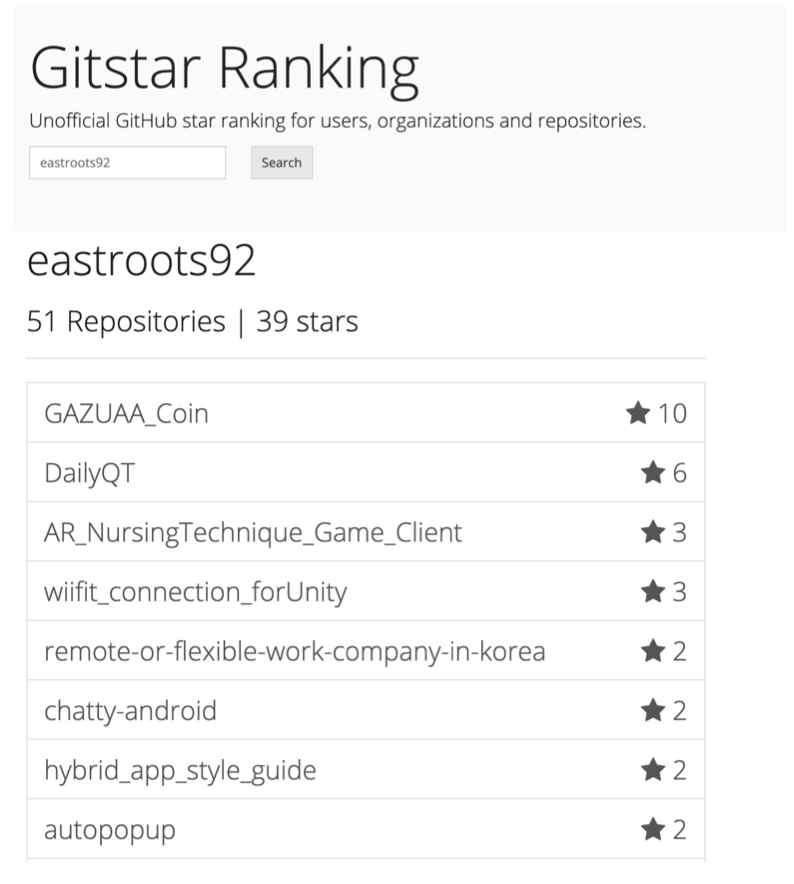

# github_star
목표: Git Star 목표 github user(또는 org) 를 검색하여 해당 user의 총 Repo 수와 총 star 수 그리고 repo별 스타들을 보여주는 page를 제작한다.

## 제작 세부 방법
1. Text Input을 통해 입력된 값을 사용하여 Github User 또는 Organization의 이름을 검색합니다.

2. 검색된 데이터를 사용하여 각 결과값의 상세값을 구하기 위한 API를 호출 합니다.

3. 검색 결과는 List로 표현되며 다음과 같은 UI로 구성됩니다.

## 기타

1. 크로스 브라우징은 고려하지 않습니다.
2. JS/ TS뿐 아니라 Style 및 모든 라이브러리는 개인이 선호하는 어떤 것을 사용해도 됩니다.
3. 만약 위 이미지의 기획상 허점이 보인다면, 개인이 스스로 개선 및 변경하여 구현하여도 무방합니다. 
4. 만약 구현이 힘든 부분이 있거나 더 나은 부분이 있다면 자유롭게 변경 가능합니다.(검색버튼 대신 입력 시 바로 자동검색 되게 한다던지) 
5. 위 내용의 API는 github api를 이용하여 데이터를 가져옵니다. 
 https://developer.github.com/v3/ (어뷰징을 막기위해 하루에 너무 자주(한번에 수십 수백번) 요청하면 하루 API 제한이 걸릴 수 있습니다.)
